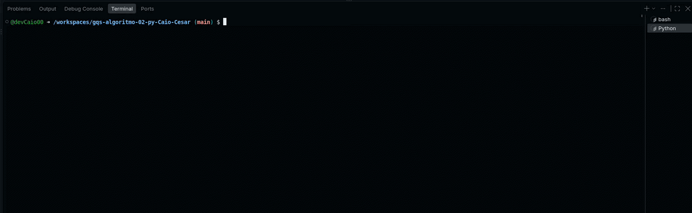

# Algoritmo de RLE (Compressor de Texto)
***-- Este algoritmo foi construido em linguagem PYTHON no CodeSpace do Github. --*** <p>


<p>

## Oque é RLE?

RLE (Run-Length Encoding) é uma técnica para comprimir um caractér repetido em número, que pode ser usado para economizar espaços de memória em um algoritmo.

## Como funciona o RLE?

O RLE (Run-Length Encoding) funciona excluindo letras de uma sequência repetida e as transferindo para um contador, então por exemplo, se a frase "AAAA" for inserida como input (entrada), o algoritmo retornará A4, pois contabilizou 4A's, e assim sucessivamente para letras diferentes e repetidas.

Este algoritmo utiliza uma função principal chamada ***comprimir_rle(texto)***, onde ocorre a operação de converter texto repetido para um contador

```Python
def comprimir_rle(texto):
    # Se o texto estiver vazio, não há nada para comprimir
    if not texto:
        return ""

    resultado = ""
    caractere_atual = texto[0]  # Começa pela primeira letra
    contador = 1

    # Percorre do segundo caractere (índice 1) até o final do texto
    for i in range(1, len(texto)):
        proximo_caractere = texto[i]

        if proximo_caractere == caractere_atual:
            # Se a letra é igual à anterior, só somamos 1 ao contador
            contador += 1
        else:
            # Se a letra mudou, guardamos a letra anterior e sua contagem no resultado
            resultado += caractere_atual + str(contador)

            # Atualizamos as variáveis para a nova letra que acabou de começar
            caractere_atual = proximo_caractere
            contador = 1

    # Adiciona o último caractere e sua contagem ao resultado
    resultado += caractere_atual + str(contador)
    return resultado
```
Além do Bloco principal de código, temos o Bloco de testes, onde adicionei a comparação do texto original com o texto comprimido e retornando a porcentagem do quanto foi diminuido na entrada original.

```python
# --- Bloco Principal de Teste ---
if __name__ == "__main__":          #Configura para rodar a função somente se for o usuário principal
    print("=== COMPRESSOR DE TEXTO RUN-LENGTH ENCODING (RLE) ===") 
    texto_original = input("Digite um texto com caracteres repetidos (ex: AAAAAABBBCCCC): ") ##Define o texto a ser analisado

    texto_comprimido = comprimir_rle(texto_original) ##Transfere a entrada do usuário para a função principal.

    print("\n--- Resultados ---") ##Compara o Texto original com o Texto comprimido
    print(f"Texto Original   : {texto_original}")
    print(f"Texto Comprimido : {texto_comprimido}")

    # Calcula a taxa de compressão da string.
    tamanho_orig = len(texto_original)
    tamanho_comp = len(texto_comprimido)
    if tamanho_orig > 0:
        reducao = ((tamanho_orig - tamanho_comp) / tamanho_orig) * 100
        print(f"Redução de tamanho: {reducao:.1f}%")
```

### OBS: ESTE ALGORITMO FOI CONSTRUÍDO COM AUXÍLIO DE IA.

## Como Acessar o algoritmo?

<p>

1. Acesse o seu perfil do Github.
2. Crie um repositório
3. Acesse o repositório [Compressor RLE](https://github.com/devCaio00/gqs-algoritmo-02-py-Caio-Cesar)

4. Clique em ***FORK*** e selecione o repositório criado em sua conta.
5. Quando estiver com o arquivo ***compressor_rle.py*** em seu repositório, crie um codespace linkado ao repositório criado.
 - Para criar o CodeSpace, acesse as 3 barrinhas laterais no canto superior esquerdo e clique em CodeSpaces.
 - Clique em New CodeSpace no canto superior direito, nomeie seu espaço de código e selecione o repositório com os arquivos .py .
 <p> 
 <p> 
 <p> 

# Aplicação do algoritmo.


Este algoritmo pode ter várias aplicações úteis na programação,como por exemplo:

- Imagens binárias simples (ícones em preto e branco)
- Arquivos com longas sequências de bytes idênticos
- Formatos gráficos antigos como BMP e TIFF.

Exemplo do algoritmo funcionando:



Como podemos ver no exemplo, a string foi divida em letras e números, ou seja, CCCC virou C4, aaaaa virou A5, e assim por diante.


# Sobre o Autor


- O Autor que criou e documentou este algoritmo foi Caio Cesar (devCaio00), estudante de Ciência da Computação.
Esta atividade foi realizada na matéria de Garantia de Qualidade de Software no dia 21/08/2026, estudo de linguagem Markdown, Criação de algoritmo e Análise de código.

- LinkedIn: [Caio Cesar](https://www.linkedin.com/in/caiioccesar/)
- Github: [Dev Caio](https://github.com/devCaio00)


